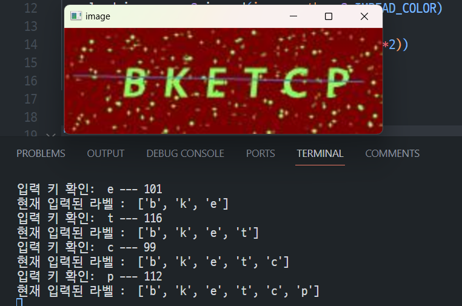
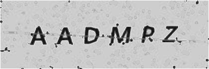

# Cap_API

### 개요

- 알파벳 이미지 캡차서버  
- 알파벳 6자리로 구성된 캡차이미지를 인식하여 결과값을 반환합니다.
<br>*이미지 형식은 .png 만 지원*

### 기술 스택


### Dependency

```
python 3.8
tensorflow 2.7.0
```

### Getting Started

```
pip install -r requirements.txt 
python main.py
```

### 폴더 구조

```
│  main.py     //API 서버 실행 
│  README.md
│
├─models        //모델폴더
│  └─bw_captcha_model
│
├─utils
  │  img_module.py  //이미지 조작용 
  │  img_processing.py   //이미지 전처리
  └─ load_model.py    //모델 불러오기
```
- utils : 이미지처리 및 모델 사용에 필요한 함수들을 담은 폴더
- models : 학습된 모델이 담긴 폴더
- main.py : api 서버 실행

### 구현과정

#### 데이터 수집 + 라벨링
-  selenium + opencv를 활용하여 이미지 수집 자동화 
- 수집한 이미지 라벨링 진행 (약 500여장)
  - opencv의 키보드 이벤트를 활용하여 라벨링진행 `이미지의 알파벳 6자리.png로 파일명 변경`

 -> 위의 경우 bketcp.png와 같은 형태로 파일이름으로 라벨링하여 저장함
  
#### 이미지 학습환경 구성 + 이미지 학습
- Docker환경에서 이미지 학습환경 구성(python3.8 + tensorflow2.7)
- train data : 482 / validation data : 54 로 나누어 학습진행


#### 모델 서빙용 API 구현
- 기능이 간단한 api였기때문에 fastapi를 사용하여 구현하였습니다.

| Method | url | 
| :-------- | :------- |
|`POST`|`/captcha ` | 

```
{
  "filename": "amldcd.png",
  "preds": [
    "amldcd"
  ]
}
```

### ISSUE

- 이미지인식 정확도 개선
>  전처리를 통해 해결 : <br>
  학습시키려는 이미지 흑백처리 -> 일정 크기 이하의 노이즈 컨투어를 구하여 색상을 배경색과 비슷하게 변경하여 재학습


  | 전처리 전 | 전처리 후 |
  |:---:|:---:|
  |  |  | 
  |||

  
  

